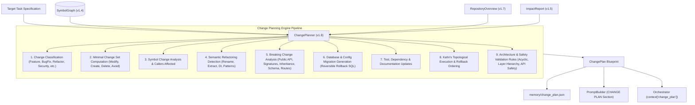
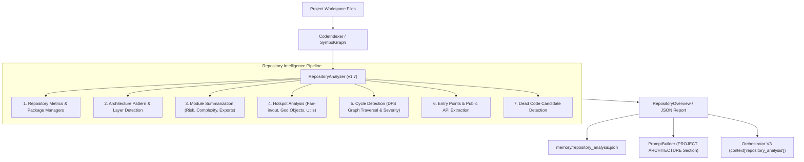
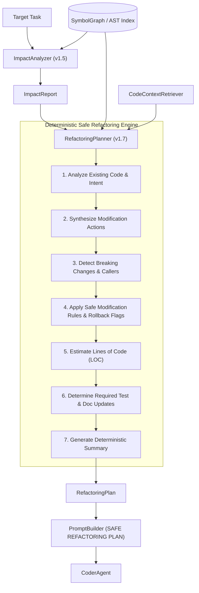
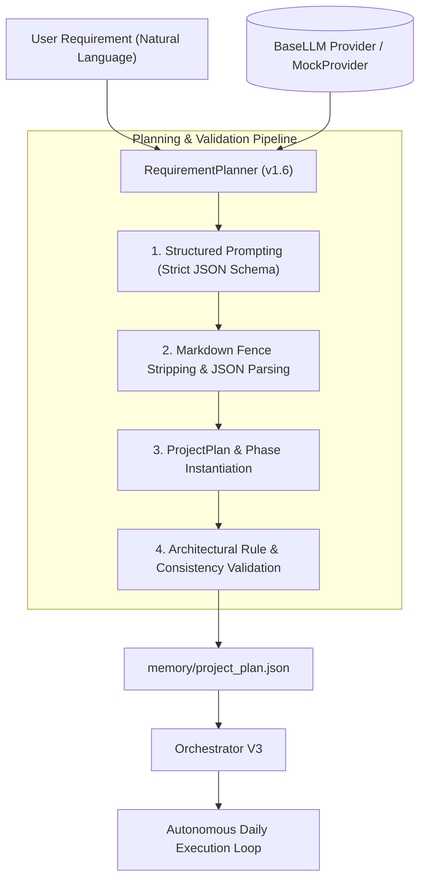
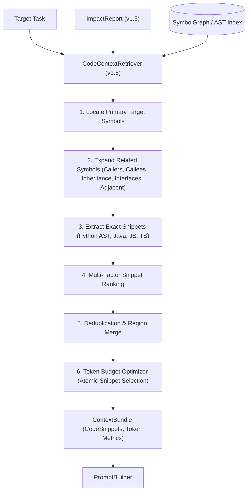
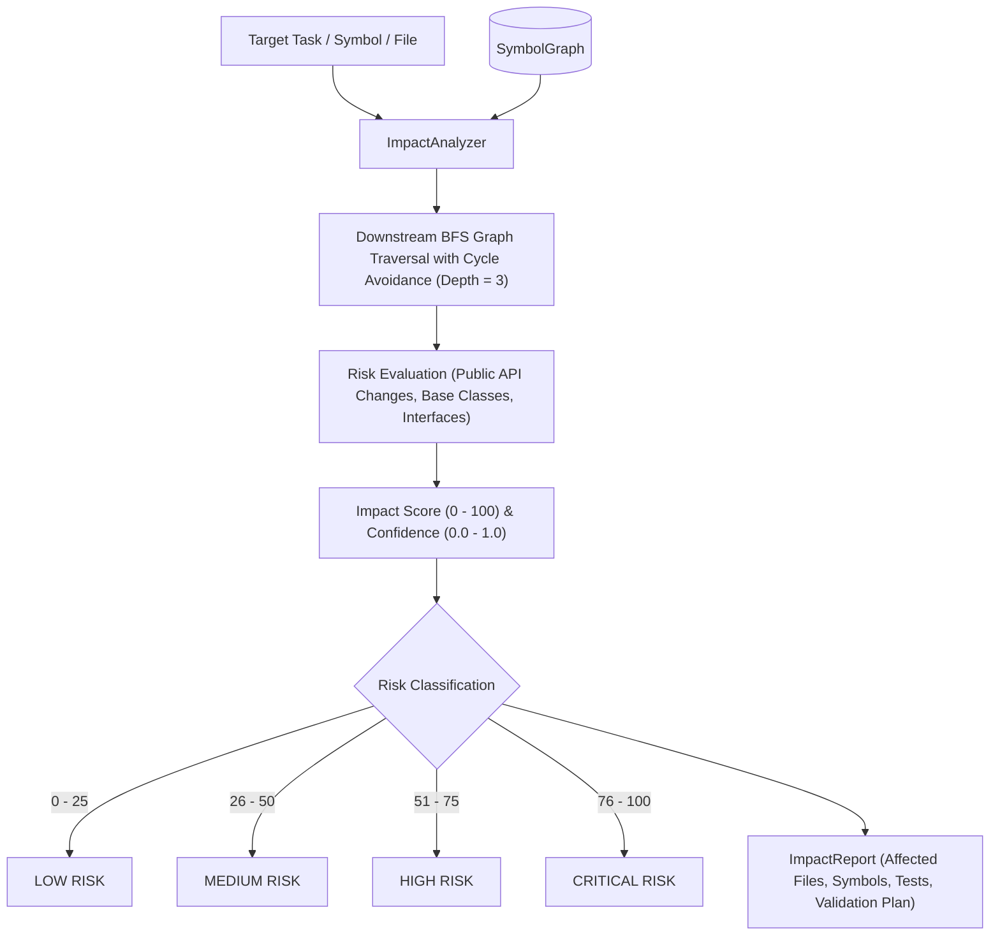

# AutoDev 🚀

> **Autonomous AI Software Development Agent** — Version 1.8 (Semantic Refactoring & Change Planning Engine)

AutoDev is a fully autonomous software engineering framework designed to translate natural-language software requirements into structured multi-day roadmaps, analyze full-repository architecture and code topologies offline, perform dependency-aware impact analysis, compute deterministic change sets and semantic refactoring plans before code generation, retrieve precise code snippets within token budgets, and execute atomic engineering tasks sequentially with specialized AI agents.

---

## 📁 Project Architecture & Directory Structure

```
autodev-agent/
├── agents/
│   ├── __init__.py
│   ├── planner_agent.py        # Core planning engine and multi-day phase synthesizer
│   ├── task_planner_agent.py   # Atomic task decomposition and dependency generator
│   ├── task_queue_manager.py   # Task lifecycle, priority queueing, and dependency resolution
│   ├── coder_agent.py          # LLM-driven code synthesis worker
│   ├── file_writer_agent.py    # Atomic file writer with path traversal protection and backups
│   ├── tester_agent.py         # Subprocess test runner with pytest detection and parsing
│   ├── reviewer_agent.py       # AI code review, defect detection, and quality scoring
│   └── git_agent.py            # Local Git version control, staging, and commit management
├── core/
│   ├── __init__.py             # Core package module exports
│   ├── change_planner.py       # Semantic Refactoring & Change Planning Engine (v1.8)
│   ├── repository_analyzer.py  # Repository Intelligence & Architecture Engine (v1.7)
│   ├── refactoring_planner.py  # Safe refactoring planner & modification engine (v1.7)
│   ├── requirement_planner.py  # Natural language requirement-to-roadmap planner (v1.6)
│   ├── code_indexer.py         # AST source scanner & symbol indexer (v1.4)
│   ├── symbol_graph.py         # Searchable symbol graph & topological dependency engine (v1.4)
│   ├── code_context_retriever.py # Code context snippet extraction & token budget optimizer (v1.6)
│   ├── impact_analyzer.py      # Dependency-aware blast radius & risk analysis engine (v1.5)
│   ├── context_builder.py      # Project context aggregation and token-aware context window
│   ├── memory_manager.py       # Persistent engineering memory layer (v1.2)
│   ├── context_injector.py     # Deterministic context injection engine (v1.3)
│   ├── prompt_builder.py       # 16-section structured prompt synthesizer (v1.8)
│   ├── state_manager.py        # Atomic state persistence, execution history, and phase tracking
│   ├── retry_engine.py         # Self-healing retry engine with defect feedback injection
│   ├── orchestrator.py         # Central pipeline orchestrator (Version 3)
│   ├── config.py               # System configuration and environment settings
│   ├── llm.py                  # BaseLLM abstraction layer and provider re-exports
│   └── providers/              # Pluggable LLM Provider Architecture (v1.1)
│       ├── __init__.py         # Provider module exports
│       ├── exceptions.py       # Provider authentication, connection, and response exceptions
│       ├── mock_provider.py    # Offline deterministic mock provider
│       ├── gemini_provider.py  # Google Gemini model integration
│       ├── openai_provider.py  # OpenAI GPT model integration
│       ├── anthropic_provider.py # Anthropic Claude model integration
│       └── provider_factory.py # Unified provider factory and dynamic registry
├── memory/
│   ├── change_plan.json        # Deterministic change blueprint & semantic refactoring plan (v1.8)
│   ├── repository_analysis.json# Global repository architecture & intelligence report (v1.7)
│   ├── code_index.json         # Persisted AST symbol graph and file dependency index (v1.4)
│   ├── project_plan.json       # Structured multi-day development plan output
│   ├── tasks.json              # Active atomic tasks queue with status & dependencies
│   ├── project_memory.json     # Long-term engineering memory & decision database (v1.2)
│   └── state.json              # Agent lifecycle and execution history state
├── projects/                   # Target workspace for generated projects
├── logs/                       # Execution run logs and operational traces
├── tests/                      # Comprehensive pytest test suite (267 tests)
├── main.py                     # CLI application and user input orchestrator
├── requirements.txt            # Dependency specification
└── README.md                   # Project documentation and architecture guide
```

---

## 🧩 Semantic Refactoring & Change Planning Engine (Version 1.8)

The [`ChangePlanner`](file:///c:/Users/veruk/Desktop/autodev-agent/core/change_planner.py) computes a deterministic, comprehensive modification blueprint before any code generation occurs. Siting directly before `CoderAgent`, it guarantees minimal change footprints, safe execution ordering, breaking change mitigation, and layer compliance completely offline without LLM hallucination.



### Supported Change Classifications
- **Feature**: New application capabilities or components.
- **Bug Fix**: Defect and crash remediation.
- **Refactor**: Structural improvements preserving external behavior.
- **Optimization**: Latency, caching, memory, and performance tuning.
- **Security Patch**: Input sanitization, vulnerability remediation, and CVE mitigation.
- **Documentation**: README, code comments, and docstrings.
- **Configuration**: Environment variables, YAML, TOML, and settings.
- **Test**: Unit test fixtures, mocks, and test assertions.
- **Build**: Dockerfile, CI/CD pipelines, and build targets.
- **Infrastructure**: Deployment scripts, cloud templates, and orchestration.

### Refactoring Pattern Detection
The engine automatically identifies semantic refactoring requirements:
- **Rename**: Symbol and module renames with deprecation shims.
- **Extract Method / Class**: Decomposing large methods and god classes.
- **Move Method / Class**: Relocating members across module boundaries.
- **Inline Method / Variable**: Collapsing trivial intermediate abstractions.
- **Split / Merge Module**: Restructuring multi-responsibility modules.
- **Dependency Injection**: Decoupling direct instantiation via constructor injection.
- **Repository / Service / Factory Extraction**: Isolating persistence, business logic, and instantiation.
- **Design Patterns**: Strategy, Adapter, Facade, Observer, and Decorator implementations.

### Breaking Change Analysis & Mitigations
- **Public API Modifications**: Deleted or modified symbols with active callers.
- **Signature Changes**: Altered parameters mitigated by default arguments or overloads.
- **Inheritance Changes**: Base class contracts verified against all derived subclasses.
- **Removed Exports & Deleted Files**: Downstream import breakage mitigated by compatibility aliases.
- **Database Migrations**: Forward schema transformations paired with automated, reversible rollback SQL.
- **REST Endpoint & CLI Changes**: Route contracts and command-line flags validated with versioning shims.

### Execution & Rollback Graphs
1. **Execution Order**: Kahn's topological sort of file dependencies ensures base models $\to$ repositories $\to$ services $\to$ controllers $\to$ tests.
2. **Rollback Order**: Strict reverse sequence guaranteeing clean recovery upon test failure or abort.

### ChangePlan JSON Schema (`memory/change_plan.json`)

```json
{
  "task_id": "TASK-01",
  "task_title": "Extract PaymentRepository from PaymentService and migrate database schema",
  "change_classification": "Refactor",
  "files_to_modify": ["services/payment_service.py", "models/payment.py"],
  "files_to_create": ["repositories/payment_repo.py", "tests/test_payment_repo.py"],
  "files_to_delete": [],
  "files_to_avoid": ["utils/helpers.py", "auth/token.py"],
  "file_changes": [
    {
      "file_path": "services/payment_service.py",
      "change_type": "MODIFY",
      "necessity_rank": "PRIMARY_TARGET",
      "reason": "Primary implementation target for task.",
      "estimated_loc": 45
    }
  ],
  "symbol_changes": [
    {
      "symbol_name": "PaymentService",
      "file_path": "services/payment_service.py",
      "change_type": "MODIFY",
      "is_breaking": false,
      "callers_affected": ["OrderController.checkout"]
    }
  ],
  "refactoring_steps": [
    {
      "refactoring_type": "Repository Extraction",
      "target": "PaymentRepository",
      "target_file": "repositories/payment_repo.py",
      "description": "Extract data access logic into dedicated PaymentRepository.",
      "rationale": "Separates persistence concerns from business logic."
    }
  ],
  "breaking_changes": [
    {
      "change_category": "DATABASE_MIGRATION",
      "target": "Database Schema",
      "target_file": "models/payment.py",
      "description": "Database schema or table structure modified, requiring an explicit migration script.",
      "impact_level": "HIGH",
      "mitigation_strategy": "Generate reversible database migration script with forward and rollback SQL."
    }
  ],
  "migration_steps": [
    {
      "migration_type": "DATABASE_SCHEMA",
      "target_file": "models/payment.py",
      "description": "Apply schema alteration for payment records.",
      "sql_or_code_action": "ALTER TABLE payments ADD COLUMN status VARCHAR(32);",
      "rollback_instruction": "ALTER TABLE payments DROP COLUMN status;",
      "is_reversible": true
    }
  ],
  "execution_order": ["models/payment.py", "repositories/payment_repo.py", "services/payment_service.py", "tests/test_payment_repo.py"],
  "rollback_order": ["tests/test_payment_repo.py", "services/payment_service.py", "repositories/payment_repo.py", "models/payment.py"],
  "risk_level": "HIGH",
  "estimated_total_lines": 115
}
```

---

## 🧠 Repository Intelligence Engine (Version 1.7)

The [`RepositoryAnalyzer`](file:///c:/Users/veruk/Desktop/autodev-agent/core/repository_analyzer.py) enables AutoDev to understand an entire existing codebase before modifying or generating code. Operating **100% deterministically and offline**, it scans the whole project topology to extract architecture patterns, logical layers, module summaries, hotspots, circular dependencies, entry points, public APIs, and dead code candidates.



### Supported Architecture Patterns
- **Layered Architecture**: Presentation $\to$ Business Logic $\to$ Data Access.
- **MVC & MVVM**: Models, Views, Controllers, ViewModels.
- **Clean & Hexagonal Architecture**: Ports, Adapters, Use Cases, Entities.
- **Repository & Service Layer Patterns**: Abstracted persistence and domain boundaries.
- **Modular Monolith & Microservices**: Co-located modular repositories vs multi-service topologies.
- **Event-Driven / PubSub**: Events, Listeners, Emitters, and Handlers.
- **Factory Pattern & Dependency Injection**: Dynamic instantiation containers and provider factories.
- **Plugin / Provider Architecture**: Pluggable extensions and dynamic registries.

### Public API Dataclasses

```python
@dataclass
class ArchitectureLayer:
    name: str
    modules: List[str]
    responsibilities: List[str]
    dependencies: List[str]
    confidence: float = 1.0

@dataclass
class ArchitectureMetrics:
    pattern_name: str
    confidence: float  # 0.0 to 1.0
    matched_indicators: List[str]
    layers_detected: List[str]
    description: str = ""

@dataclass
class ModuleSummary:
    module_path: str
    purpose: str = ""
    responsibilities: List[str] = field(default_factory=list)
    exports: List[str] = field(default_factory=list)
    dependencies: List[str] = field(default_factory=list)
    dependents: List[str] = field(default_factory=list)
    public_classes: List[str] = field(default_factory=list)
    internal_classes: List[str] = field(default_factory=list)
    functions: List[str] = field(default_factory=list)
    risk: str = "LOW"  # CRITICAL, HIGH, MEDIUM, LOW
    complexity: str = "LOW"  # HIGH, MEDIUM, LOW
    lines_of_code: int = 0

@dataclass
class Hotspot:
    category: str  # largest_module, high_fan_out, high_fan_in, most_called_function, most_inherited_class, god_object, utility_class
    target: str
    score: float
    metric_name: str
    metric_value: Any
    description: str

@dataclass
class CircularDependency:
    cycle: List[str]
    length: int
    severity: str  # CRITICAL, HIGH, MEDIUM, LOW
    description: str

@dataclass
class RepositoryOverview:
    project_name: str
    total_modules: int
    total_classes: int
    total_interfaces: int
    total_functions: int
    total_methods: int
    total_tests: int
    total_dependencies: int
    total_symbols: int
    detected_architectures: List[ArchitectureMetrics]
    architecture_layers: List[ArchitectureLayer]
    module_summaries: Dict[str, ModuleSummary]
    hotspots: List[Hotspot]
    circular_dependencies: List[CircularDependency]
    entry_points: List[str]
    public_apis: List[str]
    config_files: List[str]
    build_files: List[str]
    package_managers: List[str]
    dead_code_candidates: List[str]
    summary: str
```

### Example `memory/repository_analysis.json` Output

```json
{
  "project_name": "AutoDev Project",
  "total_modules": 5,
  "total_classes": 3,
  "total_interfaces": 0,
  "total_functions": 3,
  "total_methods": 3,
  "total_tests": 1,
  "total_dependencies": 4,
  "total_symbols": 9,
  "detected_architectures": [
    {
      "pattern_name": "Modular Monolith",
      "confidence": 0.9,
      "matched_indicators": ["Unified repository structure with co-located components."],
      "layers_detected": ["Presentation / API / CLI", "Business Logic / Core", "Data Access / Repository", "Infrastructure / Adapters", "Testing & QA"],
      "description": "Single deployable application with well-defined internal modular boundaries."
    },
    {
      "pattern_name": "Layered Architecture",
      "confidence": 0.85,
      "matched_indicators": ["Distinct separation of presentation, domain/business logic, and data access layers."],
      "layers_detected": ["Presentation / API / CLI", "Business Logic / Core", "Data Access / Repository", "Infrastructure / Adapters", "Testing & QA"],
      "description": "Separates system concerns into hierarchical presentation, service/domain, and data persistence layers."
    }
  ],
  "entry_points": [
    "controllers/order_controller.py:get_order",
    "main.py (__main__ block)"
  ],
  "hotspots": [
    {
      "category": "high_fan_in",
      "target": "services/order_service.py",
      "score": 2.0,
      "metric_name": "incoming_dependents",
      "metric_value": 2,
      "description": "Module 'services/order_service.py' is depended on by 2 other modules."
    }
  ],
  "circular_dependencies": []
}
```

---

## 🛠️ Refactoring Planner Subsystem (Version 1.7)

The [`RefactoringPlanner`](file:///c:/Users/veruk/Desktop/autodev-agent/core/refactoring_planner.py) enables AutoDev to **safely modify and refactor existing projects** rather than only generating greenfield code. It sits directly between [`ImpactAnalyzer`](file:///c:/Users/veruk/Desktop/autodev-agent/core/impact_analyzer.py) and [`CoderAgent`](file:///c:/Users/veruk/Desktop/autodev-agent/agents/coder_agent.py), producing a deterministic, 100% LLM-free [`RefactoringPlan`](file:///c:/Users/veruk/Desktop/autodev-agent/core/refactoring_planner.py).



---

## 📋 Requirement Planner Subsystem (Version 1.6)

The [`RequirementPlanner`](file:///c:/Users/veruk/Desktop/autodev-agent/core/requirement_planner.py) converts natural language software requirements into complete, multi-day, production-grade implementation roadmaps (`project_plan.json`). It acts as the very first stage before autonomous orchestration begins.



---

## 🔍 Code Context Retrieval Engine (Version 1.6)

The [`CodeContextRetriever`](file:///c:/Users/veruk/Desktop/autodev-agent/core/code_context_retriever.py) extracts only the exact, minimal, high-utility source code snippets required for the current task, rather than dumping entire source files into the prompt.



---

## 💥 Dependency-Aware Impact Analysis Engine (Version 1.5)

The [`ImpactAnalyzer`](file:///c:/Users/veruk/Desktop/autodev-agent/core/impact_analyzer.py) determines the downstream blast radius and breaking-change risks prior to code generation.



---

## 🔄 Orchestrator Execution Order & Pipeline

In [`core/orchestrator.py`](file:///c:/Users/veruk/Desktop/autodev-agent/core/orchestrator.py), every task executes through the standardized sequence:

```
0. Requirement Planning (RequirementPlanner.generate_plan if project_plan.json is missing)
        ↓
1. Repository Intelligence (RepositoryAnalyzer.analyze -> context["repository_analysis"])
        ↓
2. Impact Analysis (ImpactAnalyzer.analyze -> context["impact_report"])
        ↓
3. Semantic Change Planning (ChangePlanner.plan -> context["change_plan"] & memory/change_plan.json)
        ↓
4. Safe Refactoring Planning (RefactoringPlanner.plan -> context["refactoring_plan"])
        ↓
5. Code Context Retrieval (CodeContextRetriever.retrieve -> context["code_context"])
        ↓
6. Memory Injection (ContextInjector.build_prompt_context -> context["engineering_memory"])
        ↓
7. Prompt Synthesis (PromptBuilder.build with PROJECT ARCHITECTURE, SAFE REFACTORING PLAN & CHANGE PLAN)
        ↓
8. Code Generation (CoderAgent.execute)
```

---

## 💻 Usage Example

```python
from core.change_planner import ChangePlanner
from core.llm import BaseLLM
from core.orchestrator import Orchestrator
from core.providers.provider_factory import ProviderFactory
from core.refactoring_planner import RefactoringPlanner
from core.repository_analyzer import RepositoryAnalyzer
from core.requirement_planner import RequirementPlanner

# 1. Initialize LLM Provider
llm = ProviderFactory.create("mock")

# 2. Automatically Generate Implementation Roadmap
planner = RequirementPlanner(llm=llm)
plan = planner.generate_plan("Build a REST API with FastAPI and SQLite for managing books")
planner.save_plan(plan, "memory/project_plan.json")

# 3. Initialize Offline Intelligence & Change Planning Subsystems
repo_analyzer = RepositoryAnalyzer()
change_planner = ChangePlanner(repository_analyzer=repo_analyzer)
refactor_planner = RefactoringPlanner()

# 4. Autonomous Multi-Day Execution with Repository Intelligence & Change Planning
orchestrator = Orchestrator(
    project_root="./workspace",
    plan_path="memory/project_plan.json",
    llm=llm,
    repository_analyzer=repo_analyzer,
    change_planner=change_planner,
    refactoring_planner=refactor_planner,
)
summary = orchestrator.run()
print(f"Execution Status: {summary.status} (Tasks Completed: {len(summary.tasks_completed)})")
```

---

## 🚀 Running Tests

```bash
# Run ChangePlanner test suite (14 tests)
python -m pytest tests/test_change_planner.py -v

# Run RepositoryAnalyzer test suite
python -m pytest tests/test_repository_analyzer.py -v

# Run RefactoringPlanner test suite
python -m pytest tests/test_refactoring_planner.py -v

# Run Full Repository Test Suite (267 tests)
python -m pytest tests/ -v
```
