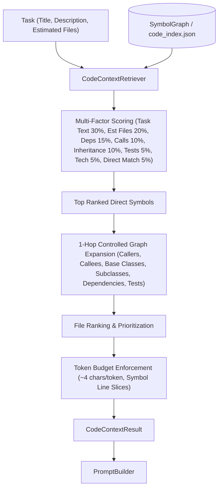
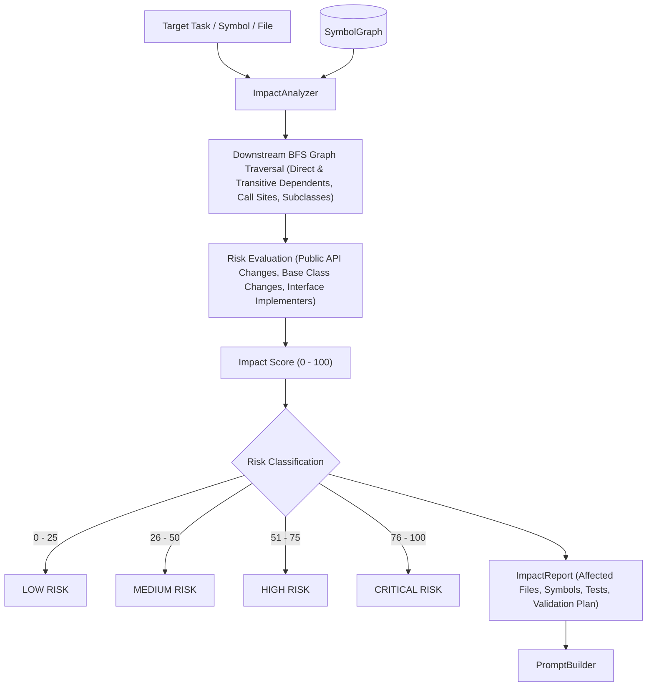

# AutoDev 🚀

> **Autonomous AI Software Development Agent** — Version 1.5 (Code-Aware Context Retrieval & Impact Analysis Engine)

AutoDev is an autonomous software development system designed to translate high-level software requirements into structured daily development phases and execute them sequentially with specialized AI and automation agents.

---

## 📁 Project Architecture & Directory Structure

```
autodev-agent/
├── agents/
│   ├── __init__.py
│   ├── planner_agent.py        # Core planning engine and multi-day phase synthesizer
│   ├── task_planner_agent.py   # Atomic task decomposition and dependency generator
│   ├── task_queue_manager.py   # Task lifecycle, priority queueing, and dependency resolution
│   ├── coder_agent.py          # LLM-driven code synthesis worker
│   ├── file_writer_agent.py    # Atomic file writer with path traversal protection and backups
│   ├── tester_agent.py         # Subprocess test runner with pytest detection and parsing
│   ├── reviewer_agent.py       # AI code review, defect detection, and quality scoring
│   └── git_agent.py            # Local Git version control, staging, and commit management
├── core/
│   ├── __init__.py             # Core package module exports
│   ├── code_indexer.py         # Deterministic AST source scanner & parser (v1.4)
│   ├── symbol_graph.py         # Searchable symbol graph & topological dependency engine (v1.4)
│   ├── code_context_retriever.py # Code-aware context retrieval & 1-hop expansion engine (v1.5)
│   ├── impact_analyzer.py      # Blast radius analysis & breaking change detection (v1.5)
│   ├── context_builder.py      # Project context aggregation and token-aware context window
│   ├── memory_manager.py       # Persistent engineering memory layer (v1.2)
│   ├── context_injector.py     # Deterministic context injection engine (v1.3)
│   ├── prompt_builder.py       # 13-section structured prompt synthesizer (v1.5)
│   ├── state_manager.py        # Atomic state persistence, execution history, and phase tracking
│   ├── retry_engine.py         # Self-healing retry engine with defect feedback injection
│   ├── orchestrator.py         # Central pipeline orchestrator (Version 3)
│   ├── config.py               # System configuration and environment settings
│   ├── llm.py                  # BaseLLM abstraction layer and provider re-exports
│   └── providers/              # Pluggable LLM Provider Architecture (v1.1)
│       ├── __init__.py         # Provider module exports
│       ├── exceptions.py       # Provider authentication, connection, and response exceptions
│       ├── mock_provider.py    # Offline deterministic mock provider
│       ├── gemini_provider.py  # Google Gemini model integration
│       ├── openai_provider.py  # OpenAI GPT model integration
│       ├── anthropic_provider.py # Anthropic Claude model integration
│       └── provider_factory.py # Unified provider factory and dynamic registry
├── memory/
│   ├── code_index.json         # Persisted AST symbol graph and file dependency index (v1.4)
│   ├── project_plan.json       # Structured multi-day development plan output
│   ├── tasks.json              # Active atomic tasks queue with status & dependencies
│   ├── project_memory.json     # Long-term engineering memory & decision database (v1.2)
│   └── state.json              # Agent lifecycle and execution history state
├── projects/                   # Target workspace for generated projects
├── logs/                       # Execution run logs and operational traces
├── tests/                      # Comprehensive pytest test suite (212+ tests)
├── main.py                     # CLI application and user input orchestrator
├── requirements.txt            # Dependency specification
└── README.md                   # Project documentation and architecture guide
```

---

## 🔍 Code-Aware Context Retrieval Engine (Version 1.5)

The [`CodeContextRetriever`](file:///c:/Users/veruk/Desktop/autodev-agent/core/code_context_retriever.py) locates the minimal, high-utility slice of the codebase required to execute an engineering task, preventing context window pollution and graph explosion.



### Retrieval Scoring Formula

| Factor | Weight | Description |
| :--- | :--- | :--- |
| **Task Text Match** | `30%` | Alphanumeric token and substring overlap with task title and description. |
| **Estimated Files Match** | `20%` | Symbols residing in task target files specified by `TaskPlannerAgent`. |
| **Dependency Edges** | `15%` | Direct imported module files and reverse dependents. |
| **Call Relationships** | `10%` | Upstream callers and downstream callees. |
| **Inheritance Hierarchy** | `10%` | Base classes, interfaces, and concrete subclasses. |
| **Test Relationships** | `5%` | Test files exercising target symbols across Python, Java, and TypeScript/JS. |
| **Tech Stack & Phase Context** | `5%` | Active technology and phase deliverable keywords. |
| **Direct Exact Match** | `5%` | Exact match on symbol identifier or class/method name. |

---

## 💥 Blast Radius & Impact Analyzer (Version 1.5)

The [`ImpactAnalyzer`](file:///c:/Users/veruk/Desktop/autodev-agent/core/impact_analyzer.py) determines the downstream blast radius and breaking change risks before AutoDev modifies files or symbols.



### Risk Level Scoring Guide

- **`LOW (0-25)`**: Private functions, isolated internal utilities with zero external callers or dependents.
- **`MEDIUM (26-50)`**: Modules with a small number of local callers or isolated class extensions.
- **`HIGH (51-75)`**: Widely used services, public APIs with 5+ callers, or core modules with direct dependents.
- **`CRITICAL (76-100)`**: Base classes with multiple subclasses, interfaces implemented by multiple classes, or foundational shared utilities.

---

## 📝 13-Section Prompt Synthesis Pipeline (Version 1.5)

[`PromptBuilder`](file:///c:/Users/veruk/Desktop/autodev-agent/core/prompt_builder.py) structures all engineering knowledge, impact warnings, and code slices into a standardized prompt sequence:

```
1. SYSTEM ROLE
2. PROJECT INFORMATION
3. TECHNOLOGY STACK
4. CURRENT DEVELOPMENT PHASE
5. RELEVANT PROJECT MEMORY (Injected by ContextInjector when relevant memories exist)
6. CURRENT TASK TO IMPLEMENT
7. CODE IMPACT ANALYSIS (Blast radius, risk level, affected callers/dependents/tests)
8. RELEVANT CODE CONTEXT (Focused file and symbol line slices under token budget)
9. RETRY & DEFECT REMEDIATION FEEDBACK (If self-healing retry attempt)
10. EXISTING DIRECTORY STRUCTURE
11. ADDITIONAL PROJECT FILES (Remaining workspace files not in Relevant Code Context)
12. ENGINEERING CONSTRAINTS (API preservation, scoped changes, JSON output rules)
13. REQUIRED JSON OUTPUT FORMAT
```

---

## 💻 Usage Example

```python
from agents.task_planner_agent import Task
from core.code_context_retriever import CodeContextRetriever
from core.code_indexer import CodeIndexer
from core.impact_analyzer import ImpactAnalyzer
from core.prompt_builder import PromptBuilder

# 1. Index Project Codebase
indexer = CodeIndexer(root_dir=".")
graph = indexer.index()

# 2. Analyze Blast Radius
analyzer = ImpactAnalyzer(symbol_graph=graph)
task = Task(
    id="TASK-AUTH-01",
    title="Modify UserService.authenticate",
    description="Enhance authentication routine to validate multi-factor tokens.",
    estimated_files=["src/user_service.py"],
)
impact_report = analyzer.analyze_task(task)
print(f"Risk Level: {impact_report.risk_level} (Score: {impact_report.impact_score}/100)")
print(f"Callers: {impact_report.callers}")
print(f"Affected Tests: {impact_report.affected_tests}")

# 3. Retrieve Focused Code Context
retriever = CodeContextRetriever(symbol_graph=graph)
context_result = retriever.retrieve(
    context={},
    task=task,
    max_tokens=4000,
)
print(f"Retrieved {len(context_result.relevant_files)} files (~{context_result.token_estimate} tokens)")

# 4. Synthesize Engineering Prompt
builder = PromptBuilder(
    code_context_retriever=retriever,
    impact_analyzer=analyzer,
)
prompt = builder.build(context={}, task=task)
```

---

## ⚡ Context Injection Engine (Version 1.3)

The [`ContextInjector`](file:///c:/Users/veruk/Desktop/autodev-agent/core/context_injector.py) synthesizes relevant historical engineering knowledge from [`MemoryManager`](file:///c:/Users/veruk/Desktop/autodev-agent/core/memory_manager.py) and injects it directly into LLM prompts via [`PromptBuilder`](file:///c:/Users/veruk/Desktop/autodev-agent/core/prompt_builder.py).

---

## 🧠 LLM Provider Plugin Architecture (Version 1.1)

AutoDev features a fully decoupled, provider-agnostic plugin architecture for Large Language Models. All agents (`CoderAgent`, `ReviewerAgent`, `TaskPlannerAgent`) communicate exclusively through the `BaseLLM` contract, allowing zero-code provider switching and complete offline testability.

| Provider | Factory Key | Default Model | Environment Variable |
| :--- | :--- | :--- | :--- |
| **Mock Provider** | `"mock"` | `mock-model-v1` | *None (Offline)* |
| **Google Gemini** | `"gemini"`, `"google"` | `gemini-1.5-pro` | `GEMINI_API_KEY` or `GOOGLE_API_KEY` |
| **OpenAI** | `"openai"`, `"chatgpt"` | `gpt-4o` | `OPENAI_API_KEY` (`OPENAI_ORG_ID` optional) |
| **Anthropic Claude** | `"anthropic"`, `"claude"` | `claude-3-5-sonnet-20241022` | `ANTHROPIC_API_KEY` |

---

## 🛠️ GitAgent Architecture & Execution Flow

The [`GitAgent`](file:///c:/Users/veruk/Desktop/autodev-agent/agents/git_agent.py) provides local version control automation after successful task execution cycles.

---

## ⚙️ Requirements

- **Python**: 3.8 or higher
- **Git**: Local Git binary available on PATH (for version control operations)
- **Pytest**: For running tests
- **Optional AI SDKs**: `google-genai` / `openai` / `anthropic` (HTTP REST fallbacks are included automatically if SDKs are not installed)

---

## 🚀 Quickstart & Usage

### 1. Interactive Mode
```bash
python main.py
```

### 2. Running the Full Test Suite
```bash
python -m pytest tests/ -v
```
