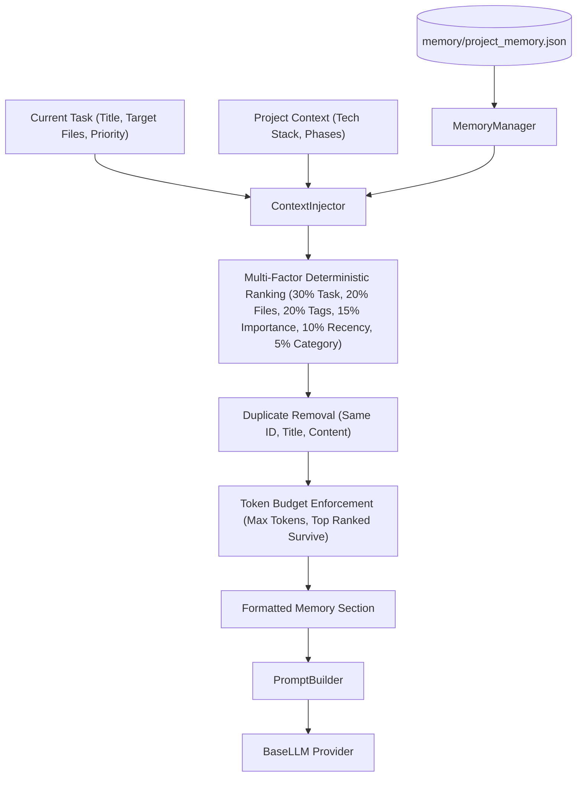
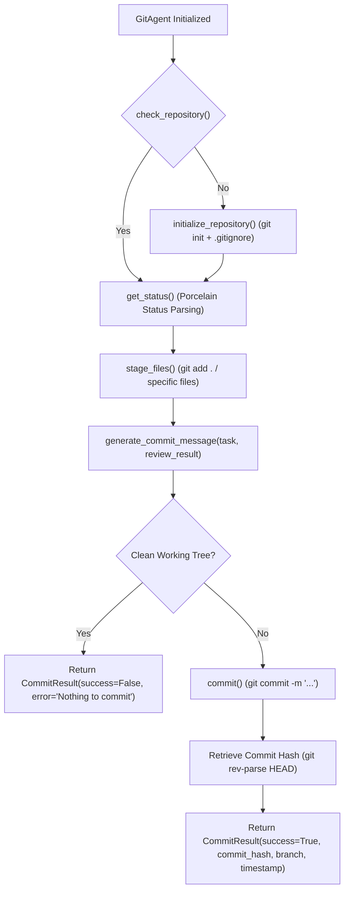

# AutoDev 🚀

> **Autonomous AI Software Development Agent** — Version 1.3 (Engineering Memory & Context Injection)

AutoDev is an autonomous software development system designed to translate high-level software requirements into structured daily development phases and execute them sequentially with specialized AI and automation agents.

---

## 📁 Project Architecture & Directory Structure

```
autodev-agent/
├── agents/
│   ├── __init__.py
│   ├── planner_agent.py        # Core planning engine and multi-day phase synthesizer
│   ├── task_planner_agent.py   # Atomic task decomposition and dependency generator
│   ├── task_queue_manager.py   # Task lifecycle, priority queueing, and dependency resolution
│   ├── coder_agent.py          # LLM-driven code synthesis worker
│   ├── file_writer_agent.py    # Atomic file writer with path traversal protection and backups
│   ├── tester_agent.py         # Subprocess test runner with pytest detection and parsing
│   ├── reviewer_agent.py       # AI code review, defect detection, and quality scoring
│   └── git_agent.py            # Local Git version control, staging, and commit management
├── core/
│   ├── __init__.py
│   ├── context_builder.py      # Project context aggregation and token-aware context window
│   ├── memory_manager.py       # Persistent engineering memory layer (v1.2)
│   ├── context_injector.py     # Deterministic context injection engine (v1.3)
│   ├── prompt_builder.py       # Deterministic prompt synthesis with memory injection
│   ├── state_manager.py        # Atomic state persistence, execution history, and phase tracking
│   ├── retry_engine.py         # Self-healing retry engine with defect feedback injection
│   ├── orchestrator.py         # Central pipeline orchestrator (Version 3)
│   ├── config.py               # System configuration and environment settings
│   ├── llm.py                  # BaseLLM abstraction layer and provider re-exports
│   └── providers/              # Pluggable LLM Provider Architecture (v1.1)
│       ├── __init__.py         # Provider module exports
│       ├── exceptions.py       # Provider authentication, connection, and response exceptions
│       ├── mock_provider.py    # Offline deterministic mock provider
│       ├── gemini_provider.py  # Google Gemini model integration
│       ├── openai_provider.py  # OpenAI GPT model integration
│       ├── anthropic_provider.py # Anthropic Claude model integration
│       └── provider_factory.py # Unified provider factory and dynamic registry
├── memory/
│   ├── project_plan.json       # Structured multi-day development plan output
│   ├── tasks.json              # Active atomic tasks queue with status & dependencies
│   ├── project_memory.json     # Long-term engineering memory & decision database (v1.2)
│   └── state.json              # Agent lifecycle and execution history state
├── projects/                   # Target workspace for generated projects
├── logs/                       # Execution run logs and operational traces
├── tests/                      # Comprehensive pytest test suite (175+ tests)
├── main.py                     # CLI application and user input orchestrator
├── requirements.txt            # Dependency specification
└── README.md                   # Project documentation and architecture guide
```

---

## ⚡ Context Injection Engine (Version 1.3)

The [`ContextInjector`](file:///c:/Users/veruk/Desktop/autodev-agent/core/context_injector.py) synthesizes relevant historical engineering knowledge from [`MemoryManager`](file:///c:/Users/veruk/Desktop/autodev-agent/core/memory_manager.py) and injects it directly into LLM prompts via [`PromptBuilder`](file:///c:/Users/veruk/Desktop/autodev-agent/core/prompt_builder.py).



### Prompt Section Layout

```
1. SYSTEM ROLE
2. PROJECT INFORMATION
3. TECHNOLOGY STACK
4. CURRENT DEVELOPMENT PHASE
5. RELEVANT PROJECT MEMORY (Injected by ContextInjector when relevant memories exist)
6. CURRENT TASK TO IMPLEMENT
7. RETRY & DEFECT REMEDIATION FEEDBACK (If self-healing attempt)
8. EXISTING DIRECTORY STRUCTURE
9. EXISTING SOURCE FILES
10. ENGINEERING CONSTRAINTS
11. REQUIRED JSON OUTPUT FORMAT
```

---

## 🧠 LLM Provider Plugin Architecture (Version 1.1)

AutoDev features a fully decoupled, provider-agnostic plugin architecture for Large Language Models. All agents (`CoderAgent`, `ReviewerAgent`, `TaskPlannerAgent`) communicate exclusively through the `BaseLLM` contract, allowing zero-code provider switching and complete offline testability.

| Provider | Factory Key | Default Model | Environment Variable |
| :--- | :--- | :--- | :--- |
| **Mock Provider** | `"mock"` | `mock-model-v1` | *None (Offline)* |
| **Google Gemini** | `"gemini"`, `"google"` | `gemini-1.5-pro` | `GEMINI_API_KEY` or `GOOGLE_API_KEY` |
| **OpenAI** | `"openai"`, `"chatgpt"` | `gpt-4o` | `OPENAI_API_KEY` (`OPENAI_ORG_ID` optional) |
| **Anthropic Claude** | `"anthropic"`, `"claude"` | `claude-3-5-sonnet-20241022` | `ANTHROPIC_API_KEY` |

---

## 🛠️ GitAgent Architecture & Execution Flow

The [`GitAgent`](file:///c:/Users/veruk/Desktop/autodev-agent/agents/git_agent.py) provides local version control automation after successful task execution cycles.



---

## ⚙️ Requirements

- **Python**: 3.8 or higher
- **Git**: Local Git binary available on PATH (for version control operations)
- **Pytest**: For running tests
- **Optional AI SDKs**: `google-genai` / `openai` / `anthropic` (HTTP REST fallbacks are included automatically if SDKs are not installed)

---

## 🚀 Quickstart & Usage

### 1. Interactive Mode
```bash
python main.py
```

### 2. Running the Full Test Suite
```bash
python -m pytest tests/ -v
```
