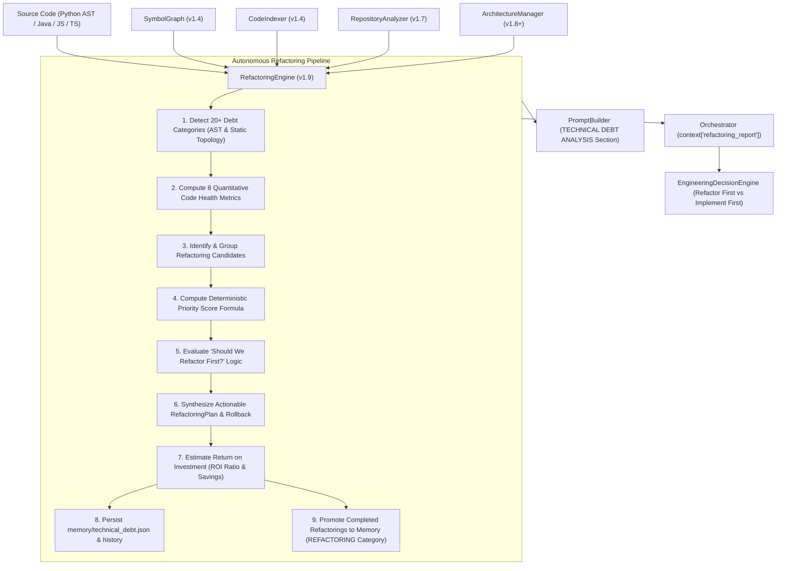
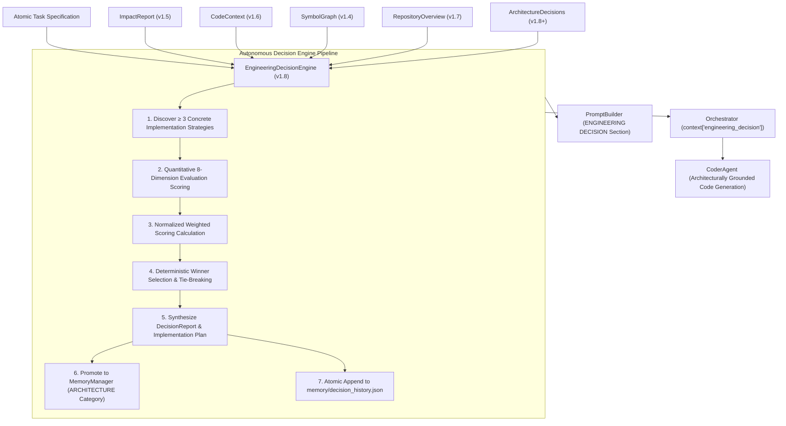
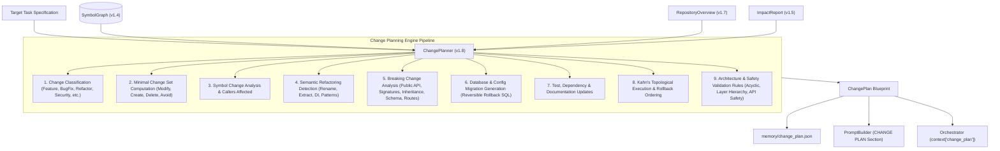
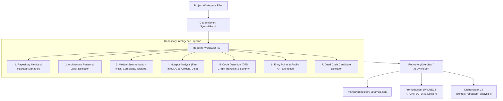
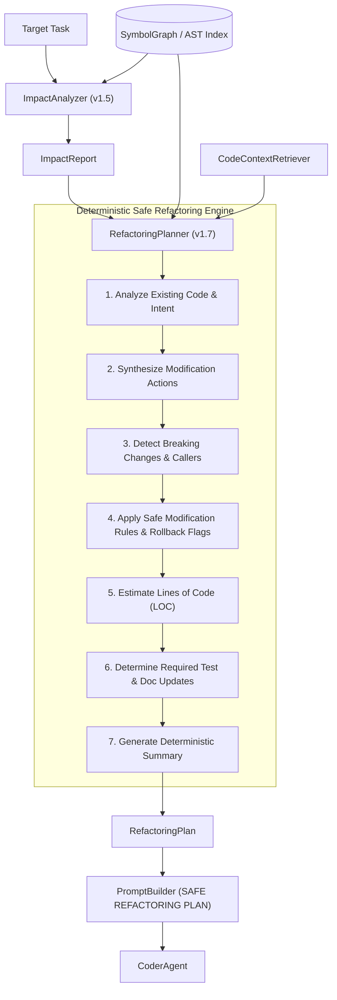
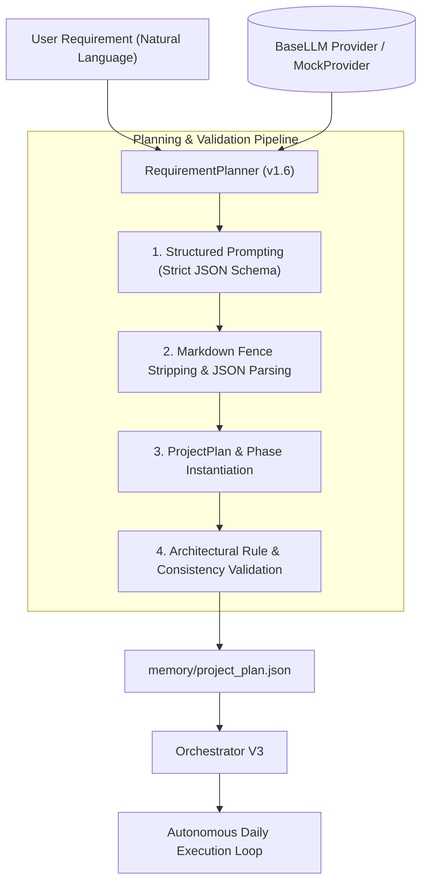
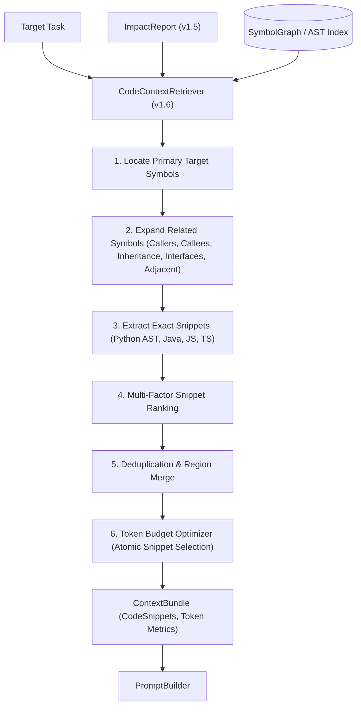
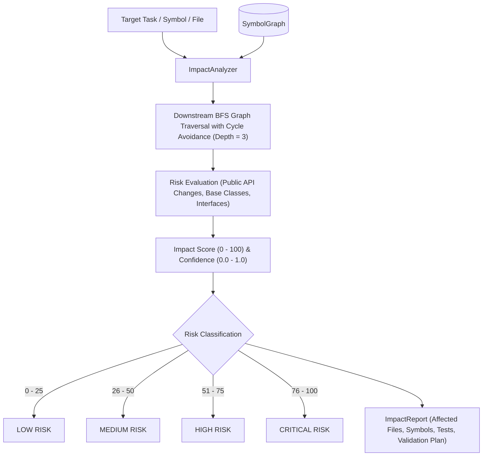
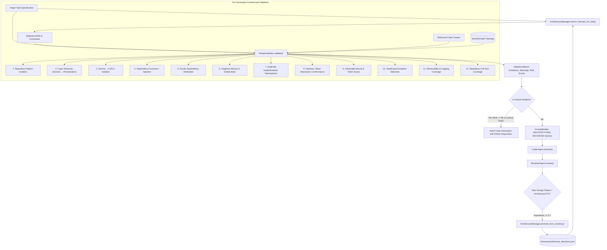
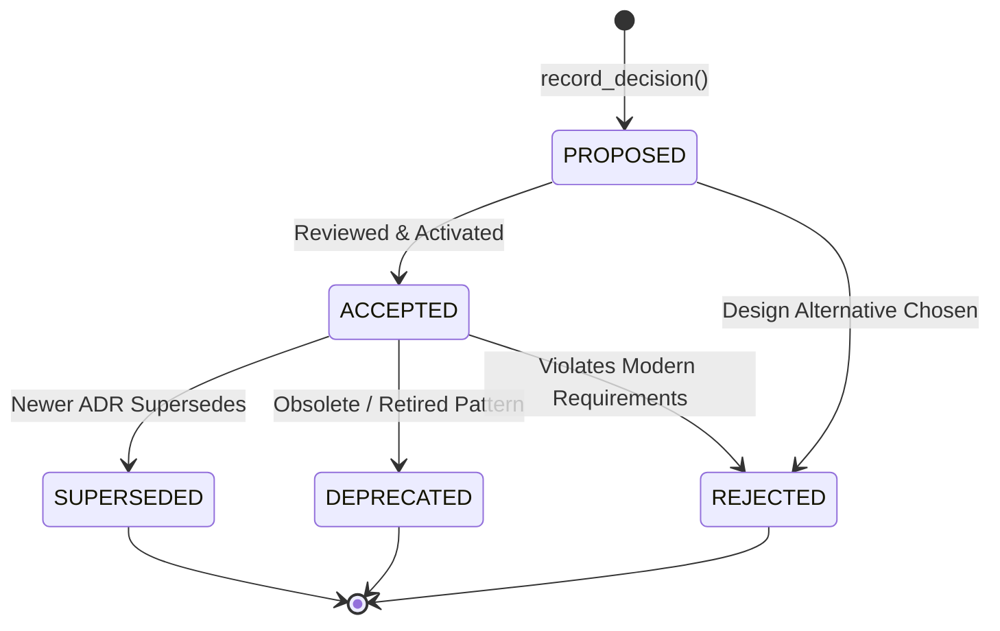

# AutoDev 🚀

> **Autonomous AI Software Development Agent** — Version 1.9 (Autonomous Refactoring & Technical Debt Engine)

AutoDev is a fully autonomous software engineering framework designed to translate natural-language software requirements into structured multi-day roadmaps, act like a senior software architect by detecting technical debt and evaluating whether refactoring should occur BEFORE implementing new features, discover multiple implementation strategies and evaluate tradeoffs across 8 dimensions before code generation, remember WHY architectural decisions were made, analyze full-repository architecture and code topologies offline, perform dependency-aware impact analysis, compute deterministic change sets and semantic refactoring plans before code generation, validate designs against 13 architectural rules, retrieve precise code snippets within token budgets, and execute atomic engineering tasks sequentially with specialized AI agents.

---

## 📁 Project Architecture & Directory Structure

```
autodev-agent/
├── agents/
│   ├── __init__.py
│   ├── planner_agent.py        # Core planning engine and multi-day phase synthesizer
│   ├── task_planner_agent.py   # Atomic task decomposition and dependency generator
│   ├── task_queue_manager.py   # Task lifecycle, priority queueing, and dependency resolution
│   ├── coder_agent.py          # LLM-driven code synthesis worker
│   ├── file_writer_agent.py    # Atomic file writer with path traversal protection and backups
│   ├── tester_agent.py         # Subprocess test runner with pytest detection and parsing
│   ├── reviewer_agent.py       # AI code review, defect detection, and quality scoring
│   └── git_agent.py            # Local Git version control, staging, and commit management
├── core/
│   ├── __init__.py             # Core package module exports
│   ├── refactoring_engine.py   # Autonomous Refactoring & Technical Debt Engine (v1.9)
│   ├── engineering_decision_engine.py # Autonomous Engineering Decision Engine (v1.8)
│   ├── architecture_manager.py # ADR Engine & Design Validator (v1.7 / v1.8+)
│   ├── change_planner.py       # Semantic Refactoring & Change Planning Engine (v1.8)
│   ├── repository_analyzer.py  # Repository Intelligence & Architecture Engine (v1.7)
│   ├── refactoring_planner.py  # Safe refactoring planner & modification engine (v1.7)
│   ├── requirement_planner.py  # Natural language requirement-to-roadmap planner (v1.6)
│   ├── code_indexer.py         # AST source scanner & symbol indexer (v1.4)
│   ├── symbol_graph.py         # Searchable symbol graph & topological dependency engine (v1.4)
│   ├── code_context_retriever.py # Code context snippet extraction & token budget optimizer (v1.6)
│   ├── impact_analyzer.py      # Dependency-aware blast radius & risk analysis engine (v1.5)
│   ├── context_builder.py      # Project context aggregation and token-aware context window
│   ├── memory_manager.py       # Persistent engineering memory layer (v1.2)
│   ├── context_injector.py     # Deterministic context injection engine (v1.3)
│   ├── prompt_builder.py       # 19-section structured prompt synthesizer (v1.9)
│   ├── state_manager.py        # Atomic state persistence, execution history, and phase tracking
│   ├── retry_engine.py         # Self-healing retry engine with defect feedback injection
│   ├── orchestrator.py         # Central pipeline orchestrator (Version 3)
│   ├── config.py               # System configuration and environment settings
│   ├── llm.py                  # BaseLLM abstraction layer and provider re-exports
│   └── providers/              # Pluggable LLM Provider Architecture (v1.1)
│       ├── __init__.py         # Provider module exports
│       ├── exceptions.py       # Provider authentication, connection, and response exceptions
│       ├── mock_provider.py    # Offline deterministic mock provider
│       ├── gemini_provider.py  # Google Gemini model integration
│       ├── openai_provider.py  # OpenAI GPT model integration
│       ├── anthropic_provider.py # Anthropic Claude model integration
│       └── provider_factory.py # Unified provider factory and dynamic registry
├── memory/
│   ├── technical_debt.json     # Persisted technical debt audit and code metrics (v1.9)
│   ├── refactoring_history.json# Persisted historical refactorings & ROI metrics (v1.9)
│   ├── decision_history.json   # Persisted engineering decision history & evaluations (v1.8)
│   ├── architecture_decisions.json # Persisted ADR database with atomic writes (v1.7 / v1.8+)
│   ├── change_plan.json        # Deterministic change blueprint & semantic refactoring plan (v1.8)
│   ├── repository_analysis.json# Global repository architecture & intelligence report (v1.7)
│   ├── code_index.json         # Persisted AST symbol graph and file dependency index (v1.4)
│   ├── project_plan.json       # Structured multi-day development plan output
│   ├── tasks.json              # Active atomic tasks queue with status & dependencies
│   ├── project_memory.json     # Long-term engineering memory & decision database (v1.2)
│   └── state.json              # Agent lifecycle and execution history state
├── projects/                   # Target workspace for generated projects
├── logs/                       # Execution run logs and operational traces
├── tests/                      # Comprehensive pytest test suite (359 tests)
├── main.py                     # CLI application and user input orchestrator
├── requirements.txt            # Dependency specification
└── README.md                   # Project documentation and architecture guide
```

## 🛠️ Autonomous Refactoring & Technical Debt Engine (Version 1.9)

Before AutoDev modifies or generates code, it analyzes the entire repository for **technical debt, architectural smells, code complexity, and anti-patterns** to determine whether refactoring should occur **BEFORE** implementing the requested feature.

It operates entirely offline with **zero LLM hallucinations**, reusing the cached `SymbolGraph`, `CodeIndexer`, `RepositoryAnalyzer`, and `ArchitectureManager`.

### Senior Software Architect Assessment
The Refactoring Engine answers:
1. **Should we refactor first?** (Evaluates risk thresholds, high-severity smells, maintainability degradation, and target file overlap).
2. **What exactly should be refactored?** (Identifies precise files, symbols, line numbers, and categories).
3. **Why?** (Deterministic root cause analysis and maintainability impact score).
4. **How risky is the refactor?** (Categorizes into `LOW`, `MEDIUM`, `HIGH`, `CRITICAL`).
5. **Will it reduce future maintenance cost?** (Computes Return on Investment (ROI), hours saved, and bug reduction probability).
6. **Can the refactor be performed safely?** (Generates ordered atomic actions, migration steps, and Git soft rollback strategies).
7. **What existing tests protect it?** (Maps required regression test files).

### Autonomous Technical Debt Engine Pipeline



### Deterministic Code Smell & Anti-Pattern Detection Rules

| Category | Detection Rule & Threshold | Severity | Impact |
| :--- | :--- | :---: | :---: |
| **Long Method** | Function length exceeds **> 50 LOC** | `MEDIUM` / `HIGH` | Extract helper methods |
| **Large Class** | Class length exceeds **> 500 LOC** or contains **> 20 methods** | `HIGH` / `CRITICAL` | Single responsibility decomposition |
| **Too Many Parameters** | Function signature accepts **> 7 parameters** | `MEDIUM` | Introduce parameter object / DTO |
| **High Cyclomatic Complexity** | Branching complexity **$CC \ge 10$** (`if`, `for`, `while`, `try`, `bool_ops`) | `HIGH` / `CRITICAL` | Guard clauses & polymorphism |
| **Deep Nesting** | Control flow nesting depth **$\ge 5$ levels** | `MEDIUM` / `HIGH` | Early returns & flatten indentation |
| **Complex Conditionals** | Boolean expressions chaining **$\ge 4$ operators** | `MEDIUM` | Extract predicate helper functions |
| **Magic Numbers** | Unnamed numeric literals outside standard range $[0, 10]$ | `LOW` | Parameterize named constants / Enums |
| **Duplicate Code** | AST normalized token chunk hashing across multiple locations | `MEDIUM` / `HIGH` | Extract shared utility functions |
| **Dead Code** | Unreferenced symbols with **0 incoming callers** across codebase | `MEDIUM` | Safely remove unused dead symbols |
| **Unused Imports** | Imported modules / symbols never referenced in source file | `LOW` | Clean module namespace |
| **Unused Variables** | Local variables assigned but never read | `LOW` | Remove unused variables |
| **Circular Dependency** | Dependency cycle detected across modules in `SymbolGraph` | `CRITICAL` | Dependency Inversion / Interfaces |
| **God Object** | Monolithic class coordinating excessive disparate responsibilities | `CRITICAL` | Split into domain services & repositories |
| **Low Cohesion** | Lack of Cohesion of Methods ($LCOM > 0.75$) | `MEDIUM` | Group unrelated methods into classes |
| **Interface Bloat** | Abstract interface violating ISP with **> 10 abstract methods** | `HIGH` | Role-specific interface segregation |
| **Architecture ADR Violation** | Explicit violation of accepted Architecture Decision Record | `HIGH` / `CRITICAL` | Enforce recorded architecture rules |
| **Improper Layering** | Lower data layer (DB / DAO) directly importing presentation layer (API) | `CRITICAL` | Restore Clean Architecture flow |

### Quantitative Metrics & Health Formulas

The Refactoring Engine computes 8 quantitative health metrics:

$$\text{Maintainability Index (MI)} = \max\left(0, \min\left(100, 171 - 5.2 \ln(\text{Avg LOC}) - 0.23 \times CC - 16.2 \ln(\text{Halstead Volume}) + 50 \times \sin\left(\sqrt{2.4 \times \text{DocRatio}}\right)\right)\right)$$

$$\text{Priority Score} = \text{Severity Score} + \text{Technical Debt Score} + \text{Business Impact} + \text{Architecture Risk} + \text{Maintainability Gain} - \text{Refactoring Cost}$$

$$\text{ROI Ratio} = \frac{\text{Development Time Saved (hrs)} + \text{Future Maintenance Savings (hrs)}}{\text{Total Refactoring Estimated Hours}}$$

---

## 🧠 Autonomous Engineering Decision Engine (Version 1.8)

Before AutoDev writes a single line of code, it acts like a **Principal Software Architect**. Instead of leaping straight into code generation, it discovers at least three concrete implementation strategies, evaluates multi-dimensional architectural tradeoffs, estimates engineering risks and maintainability, calculates deterministic scores, breaks ties deterministically, persists decisions to long-term memory (`memory/decision_history.json`), and injects complete architectural reasoning into LLM prompts via `PromptBuilder`.

### Architectural Decision Engine Workflow



### Deterministic 8-Dimension Scoring Matrix

Each candidate strategy is evaluated across 8 objective dimensions on a 0–100 scale:

| Dimension | Default Weight | Objective Criteria Evaluated |
| :--- | :---: | :--- |
| **Maintainability** | `20%` | Cyclomatic complexity, code modularity, single responsibility, loose coupling |
| **Engineering Risk** | `20%` | Blast radius, breaking change likelihood, external dependencies, rollback ease |
| **Performance** | `15%` | Algorithmic time complexity, CPU/memory overhead, I/O efficiency, caching friendliness |
| **Complexity** | `15%` | File touch count, cognitive load, boilerplate level, structural overhead |
| **Testability** | `10%` | Mockability, fixture isolation, deterministic assertions, test setup effort |
| **Scalability** | `10%` | Horizontal worker scale, statelessness, concurrency safety, dataset growth |
| **Future Extensibility** | `10%` | Open/Closed principle compliance, pluggable interfaces, extension friction |
| **Documentation Impact** | *(Bonus/Aux)* | Schema transparency, self-documenting APIs, docstring generation burden |

#### Deterministic Tie-Breaking Rules
If two or more options yield identical weighted scores:
1. **Prefer Lower Complexity** (Lowest cognitive overhead and minimal file surface)
2. **Prefer Lower Engineering Risk** (Minimal blast radius and failure modes)
3. **Prefer Higher Maintainability** (Long-term code health and modularity)

### Prompt Integration (`ENGINEERING DECISION` Block)

Before code generation begins, `PromptBuilder` automatically injects the structured architectural decision into section 4:

```markdown
================================================================================
ENGINEERING DECISION
================================================================================
Chosen Strategy: Stateless JWT Token Authentication with HMAC-SHA256
Why: Zero database lookups per request, horizontally scalable across worker processes, and low implementation complexity.
Alternatives Considered:
  - Stateful Server-Side Session Authentication with In-Memory / Redis Store (Score: 78.5)
  - OAuth2 / OpenID Connect Delegation with External Identity Provider (Score: 71.0)
Tradeoffs: Token revocation requires short TTLs or blocklists, but eliminates DB contention on auth verification.
Expected Risks: Low risk of signature mismatch or token expiration edge cases.
Implementation Plan:
  1. Implement TokenManager with HMAC-SHA256 encode/decode methods.
  2. Create authentication middleware to extract and validate Bearer headers.
  3. Add token expiration handling and signature mismatch exception propagation.
  4. Write unit tests verifying valid decoding, expiration rejection, and tampered token detection.
================================================================================
```

### Core Dataclasses & Public API

```python
from core.engineering_decision_engine import (
    DecisionOption,
    DecisionEvaluation,
    EngineeringDecision,
    DecisionReport,
    EngineeringDecisionEngine,
)

# Initialize decision engine
engine = EngineeringDecisionEngine(
    memory_manager=memory_manager,
    history_path="memory/decision_history.json",
    weights={
        "maintainability": 0.25,
        "risk": 0.25,
        "performance": 0.15,
        "complexity": 0.15,
        "testability": 0.10,
        "scalability": 0.05,
        "future": 0.05,
    }
)

# 1. Discover strategies
options = engine.generate_options(task, impact_report, code_context)

# 2. Evaluate tradeoffs deterministically
evaluations = engine.evaluate_options(options, task)

# 3. Select optimal strategy
decision = engine.choose_best_option(options, evaluations, task)

# 4. End-to-end atomic decision pipeline
report = engine.decide(task, impact_report=impact_report, code_context=code_context)

# 5. Query historical decisions
auth_decisions = engine.query_history(query="JWT Authentication")
telemetry = engine.get_telemetry()
```

---

## 🧩 Semantic Refactoring & Change Planning Engine (Version 1.8)

The [`ChangePlanner`](file:///c:/Users/veruk/Desktop/autodev-agent/core/change_planner.py) computes a deterministic, comprehensive modification blueprint before any code generation occurs. Siting directly before `CoderAgent`, it guarantees minimal change footprints, safe execution ordering, breaking change mitigation, and layer compliance completely offline without LLM hallucination.



### Supported Change Classifications
- **Feature**: New application capabilities or components.
- **Bug Fix**: Defect and crash remediation.
- **Refactor**: Structural improvements preserving external behavior.
- **Optimization**: Latency, caching, memory, and performance tuning.
- **Security Patch**: Input sanitization, vulnerability remediation, and CVE mitigation.
- **Documentation**: README, code comments, and docstrings.
- **Configuration**: Environment variables, YAML, TOML, and settings.
- **Test**: Unit test fixtures, mocks, and test assertions.
- **Build**: Dockerfile, CI/CD pipelines, and build targets.
- **Infrastructure**: Deployment scripts, cloud templates, and orchestration.

### Refactoring Pattern Detection
The engine automatically identifies semantic refactoring requirements:
- **Rename**: Symbol and module renames with deprecation shims.
- **Extract Method / Class**: Decomposing large methods and god classes.
- **Move Method / Class**: Relocating members across module boundaries.
- **Inline Method / Variable**: Collapsing trivial intermediate abstractions.
- **Split / Merge Module**: Restructuring multi-responsibility modules.
- **Dependency Injection**: Decoupling direct instantiation via constructor injection.
- **Repository / Service / Factory Extraction**: Isolating persistence, business logic, and instantiation.
- **Design Patterns**: Strategy, Adapter, Facade, Observer, and Decorator implementations.

### Breaking Change Analysis & Mitigations
- **Public API Modifications**: Deleted or modified symbols with active callers.
- **Signature Changes**: Altered parameters mitigated by default arguments or overloads.
- **Inheritance Changes**: Base class contracts verified against all derived subclasses.
- **Removed Exports & Deleted Files**: Downstream import breakage mitigated by compatibility aliases.
- **Database Migrations**: Forward schema transformations paired with automated, reversible rollback SQL.
- **REST Endpoint & CLI Changes**: Route contracts and command-line flags validated with versioning shims.

### Execution & Rollback Graphs
1. **Execution Order**: Kahn's topological sort of file dependencies ensures base models $\to$ repositories $\to$ services $\to$ controllers $\to$ tests.
2. **Rollback Order**: Strict reverse sequence guaranteeing clean recovery upon test failure or abort.

### ChangePlan JSON Schema (`memory/change_plan.json`)

```json
{
  "task_id": "TASK-01",
  "task_title": "Extract PaymentRepository from PaymentService and migrate database schema",
  "change_classification": "Refactor",
  "files_to_modify": ["services/payment_service.py", "models/payment.py"],
  "files_to_create": ["repositories/payment_repo.py", "tests/test_payment_repo.py"],
  "files_to_delete": [],
  "files_to_avoid": ["utils/helpers.py", "auth/token.py"],
  "file_changes": [
    {
      "file_path": "services/payment_service.py",
      "change_type": "MODIFY",
      "necessity_rank": "PRIMARY_TARGET",
      "reason": "Primary implementation target for task.",
      "estimated_loc": 45
    }
  ],
  "symbol_changes": [
    {
      "symbol_name": "PaymentService",
      "file_path": "services/payment_service.py",
      "change_type": "MODIFY",
      "is_breaking": false,
      "callers_affected": ["OrderController.checkout"]
    }
  ],
  "refactoring_steps": [
    {
      "refactoring_type": "Repository Extraction",
      "target": "PaymentRepository",
      "target_file": "repositories/payment_repo.py",
      "description": "Extract data access logic into dedicated PaymentRepository.",
      "rationale": "Separates persistence concerns from business logic."
    }
  ],
  "breaking_changes": [
    {
      "change_category": "DATABASE_MIGRATION",
      "target": "Database Schema",
      "target_file": "models/payment.py",
      "description": "Database schema or table structure modified, requiring an explicit migration script.",
      "impact_level": "HIGH",
      "mitigation_strategy": "Generate reversible database migration script with forward and rollback SQL."
    }
  ],
  "migration_steps": [
    {
      "migration_type": "DATABASE_SCHEMA",
      "target_file": "models/payment.py",
      "description": "Apply schema alteration for payment records.",
      "sql_or_code_action": "ALTER TABLE payments ADD COLUMN status VARCHAR(32);",
      "rollback_instruction": "ALTER TABLE payments DROP COLUMN status;",
      "is_reversible": true
    }
  ],
  "execution_order": ["models/payment.py", "repositories/payment_repo.py", "services/payment_service.py", "tests/test_payment_repo.py"],
  "rollback_order": ["tests/test_payment_repo.py", "services/payment_service.py", "repositories/payment_repo.py", "models/payment.py"],
  "risk_level": "HIGH",
  "estimated_total_lines": 115
}
```

---

## 🧠 Repository Intelligence Engine (Version 1.7)

The [`RepositoryAnalyzer`](file:///c:/Users/veruk/Desktop/autodev-agent/core/repository_analyzer.py) enables AutoDev to understand an entire existing codebase before modifying or generating code. Operating **100% deterministically and offline**, it scans the whole project topology to extract architecture patterns, logical layers, module summaries, hotspots, circular dependencies, entry points, public APIs, and dead code candidates.



### Supported Architecture Patterns
- **Layered Architecture**: Presentation $\to$ Business Logic $\to$ Data Access.
- **MVC & MVVM**: Models, Views, Controllers, ViewModels.
- **Clean & Hexagonal Architecture**: Ports, Adapters, Use Cases, Entities.
- **Repository & Service Layer Patterns**: Abstracted persistence and domain boundaries.
- **Modular Monolith & Microservices**: Co-located modular repositories vs multi-service topologies.
- **Event-Driven / PubSub**: Events, Listeners, Emitters, and Handlers.
- **Factory Pattern & Dependency Injection**: Dynamic instantiation containers and provider factories.
- **Plugin / Provider Architecture**: Pluggable extensions and dynamic registries.

### Public API Dataclasses

```python
@dataclass
class ArchitectureLayer:
    name: str
    modules: List[str]
    responsibilities: List[str]
    dependencies: List[str]
    confidence: float = 1.0

@dataclass
class ArchitectureMetrics:
    pattern_name: str
    confidence: float  # 0.0 to 1.0
    matched_indicators: List[str]
    layers_detected: List[str]
    description: str = ""

@dataclass
class ModuleSummary:
    module_path: str
    purpose: str = ""
    responsibilities: List[str] = field(default_factory=list)
    exports: List[str] = field(default_factory=list)
    dependencies: List[str] = field(default_factory=list)
    dependents: List[str] = field(default_factory=list)
    public_classes: List[str] = field(default_factory=list)
    internal_classes: List[str] = field(default_factory=list)
    functions: List[str] = field(default_factory=list)
    risk: str = "LOW"  # CRITICAL, HIGH, MEDIUM, LOW
    complexity: str = "LOW"  # HIGH, MEDIUM, LOW
    lines_of_code: int = 0

@dataclass
class Hotspot:
    category: str  # largest_module, high_fan_out, high_fan_in, most_called_function, most_inherited_class, god_object, utility_class
    target: str
    score: float
    metric_name: str
    metric_value: Any
    description: str

@dataclass
class CircularDependency:
    cycle: List[str]
    length: int
    severity: str  # CRITICAL, HIGH, MEDIUM, LOW
    description: str

@dataclass
class RepositoryOverview:
    project_name: str
    total_modules: int
    total_classes: int
    total_interfaces: int
    total_functions: int
    total_methods: int
    total_tests: int
    total_dependencies: int
    total_symbols: int
    detected_architectures: List[ArchitectureMetrics]
    architecture_layers: List[ArchitectureLayer]
    module_summaries: Dict[str, ModuleSummary]
    hotspots: List[Hotspot]
    circular_dependencies: List[CircularDependency]
    entry_points: List[str]
    public_apis: List[str]
    config_files: List[str]
    build_files: List[str]
    package_managers: List[str]
    dead_code_candidates: List[str]
    summary: str
```

### Example `memory/repository_analysis.json` Output

```json
{
  "project_name": "AutoDev Project",
  "total_modules": 5,
  "total_classes": 3,
  "total_interfaces": 0,
  "total_functions": 3,
  "total_methods": 3,
  "total_tests": 1,
  "total_dependencies": 4,
  "total_symbols": 9,
  "detected_architectures": [
    {
      "pattern_name": "Modular Monolith",
      "confidence": 0.9,
      "matched_indicators": ["Unified repository structure with co-located components."],
      "layers_detected": ["Presentation / API / CLI", "Business Logic / Core", "Data Access / Repository", "Infrastructure / Adapters", "Testing & QA"],
      "description": "Single deployable application with well-defined internal modular boundaries."
    },
    {
      "pattern_name": "Layered Architecture",
      "confidence": 0.85,
      "matched_indicators": ["Distinct separation of presentation, domain/business logic, and data access layers."],
      "layers_detected": ["Presentation / API / CLI", "Business Logic / Core", "Data Access / Repository", "Infrastructure / Adapters", "Testing & QA"],
      "description": "Separates system concerns into hierarchical presentation, service/domain, and data persistence layers."
    }
  ],
  "entry_points": [
    "controllers/order_controller.py:get_order",
    "main.py (__main__ block)"
  ],
  "hotspots": [
    {
      "category": "high_fan_in",
      "target": "services/order_service.py",
      "score": 2.0,
      "metric_name": "incoming_dependents",
      "metric_value": 2,
      "description": "Module 'services/order_service.py' is depended on by 2 other modules."
    }
  ],
  "circular_dependencies": []
}
```

---

## 🛠️ Refactoring Planner Subsystem (Version 1.7)

The [`RefactoringPlanner`](file:///c:/Users/veruk/Desktop/autodev-agent/core/refactoring_planner.py) enables AutoDev to **safely modify and refactor existing projects** rather than only generating greenfield code. It sits directly between [`ImpactAnalyzer`](file:///c:/Users/veruk/Desktop/autodev-agent/core/impact_analyzer.py) and [`CoderAgent`](file:///c:/Users/veruk/Desktop/autodev-agent/agents/coder_agent.py), producing a deterministic, 100% LLM-free [`RefactoringPlan`](file:///c:/Users/veruk/Desktop/autodev-agent/core/refactoring_planner.py).



---

## 📋 Requirement Planner Subsystem (Version 1.6)

The [`RequirementPlanner`](file:///c:/Users/veruk/Desktop/autodev-agent/core/requirement_planner.py) converts natural language software requirements into complete, multi-day, production-grade implementation roadmaps (`project_plan.json`). It acts as the very first stage before autonomous orchestration begins.



---

## 🔍 Code Context Retrieval Engine (Version 1.6)

The [`CodeContextRetriever`](file:///c:/Users/veruk/Desktop/autodev-agent/core/code_context_retriever.py) extracts only the exact, minimal, high-utility source code snippets required for the current task, rather than dumping entire source files into the prompt.



---

## 💥 Dependency-Aware Impact Analysis Engine (Version 1.5)

The [`ImpactAnalyzer`](file:///c:/Users/veruk/Desktop/autodev-agent/core/impact_analyzer.py) determines the downstream blast radius and breaking-change risks prior to code generation.



---

## 🏛️ Architecture Decision Record (ADR) Engine & Design Validator

The [`ArchitectureManager`](file:///c:/Users/veruk/Desktop/autodev-agent/core/architecture_manager.py) and [`DesignValidator`](file:///c:/Users/veruk/Desktop/autodev-agent/core/architecture_manager.py#L279-L430) enable AutoDev to remember **WHY** architectural choices were made, prevent architectural drift, and validate that future code changes strictly adhere to established design decisions and system patterns.



### 19 Standard Decision Categories
- `DATABASE` • `API` • `SECURITY` • `AUTHENTICATION` • `AUTHORIZATION` • `PERFORMANCE` • `CACHING` • `ARCHITECTURE` • `DEPENDENCY_INVERSION` • `ERROR_HANDLING` • `LOGGING` • `TESTING` • `DEPLOYMENT` • `INFRASTRUCTURE` • `BUILD_SYSTEM` • `LLM` • `PROMPT_ENGINEERING` • `MEMORY` • `CODE_STYLE`

### ADR Lifecycle State Machine


### 13 Deterministic Validation Rules
1. **Repository Pattern Isolation**: Enforces database and SQL queries reside exclusively within repository classes, preventing raw SQL in business services.
2. **Layer Violations (Domain ↛ Presentation)**: Guarantees core domain entities never import presentation, API, or web controllers.
3. **Service Calling UI Layer**: Prevents business logic from importing UI components, CLI handlers, or web endpoints.
4. **Dependency Inversion / Injection**: Detects hardcoded direct concrete instantiations, requiring constructor parameter injection.
5. **Acyclic Dependency Verification**: Deterministically detects cycle introductions across module dependency graphs via topological DFS traversal.
6. **Singleton Misuse & Mutable Global State**: Flags anti-pattern mutable global singleton states.
7. **Duplicate Implementation Namespaces**: Prevents duplicate class declarations across distinct non-test modules.
8. **Interface & Base Abstraction Conformance**: Validates provider implementations inherit from base abstract classes (e.g. `BaseLLM`).
9. **Hardcoded Credentials & Secrets**: Scans for embedded API keys, private keys, bearer tokens, and credentials.
10. **Swallowed Exceptions**: Flags bare `except: pass` exception suppressions.
11. **Observability & Logging Coverage**: Checks that major engines, agents, and orchestrator files contain structured telemetry loggers.
12. **Mandatory Test Coverage**: Verifies that new business logic is accompanied by automated unit or integration tests.
13. **Risk Scoring Engine**: Computes a normalized risk score (0-100) and halts execution on critical architectural drift.

---

## 🔄 Orchestrator Execution Order & Pipeline

In [`core/orchestrator.py`](file:///c:/Users/veruk/Desktop/autodev-agent/core/orchestrator.py), every task executes through the standardized sequence:

```
0. Requirement Planning (RequirementPlanner.generate_plan if project_plan.json is missing)
        ↓
1. Repository Intelligence (RepositoryAnalyzer.analyze -> context["repository_analysis"])
        ↓
2. Impact Analysis (ImpactAnalyzer.analyze -> context["impact_report"])
        ↓
3. Semantic Change Planning (ChangePlanner.plan -> context["change_plan"] & memory/change_plan.json)
        ↓
4. Safe Refactoring Planning (RefactoringPlanner.plan -> context["refactoring_plan"])
        ↓
5. Architecture Decision Retrieval (ArchitectureManager.search_relevant_for_task -> context["architecture_decisions"])
        ↓
6. Pre-Generation Design Validation (DesignValidator.validate -> context["validation_report"])
        ↓ (Aborts if CRITICAL violation detected)
7. Autonomous Engineering Decision Engine (EngineeringDecisionEngine.decide -> context["engineering_decision"] & memory/decision_history.json)
        ↓
8. Code Context Retrieval (CodeContextRetriever.retrieve -> context["code_context"])
        ↓
9. Memory Injection (ContextInjector.build_prompt_context -> context["engineering_memory"])
        ↓
10. Prompt Synthesis (PromptBuilder.build with ENGINEERING DECISION, ADRs, CHANGE PLAN & REFACTORING PLAN)
        ↓
11. Code Generation (CoderAgent.execute)
        ↓
12. Test & Review (TesterAgent -> ReviewerAgent)
        ↓
13. Memory & ADR Promotion (ArchitectureManager.promote_from_memory on accepted solutions)
```

---

## 💻 Usage Example

```python
from core.architecture_manager import ArchitectureManager, DecisionCategory, DecisionStatus, DesignValidator
from core.change_planner import ChangePlanner
from core.engineering_decision_engine import EngineeringDecisionEngine
from core.llm import BaseLLM
from core.orchestrator import Orchestrator
from core.providers.provider_factory import ProviderFactory
from core.refactoring_engine import RefactoringEngine
from core.refactoring_planner import RefactoringPlanner
from core.repository_analyzer import RepositoryAnalyzer
from core.requirement_planner import RequirementPlanner

# 1. Initialize LLM Provider & Architecture Manager
llm = ProviderFactory.create("mock")
adr_manager = ArchitectureManager(persistence_path="memory/architecture_decisions.json")

# 2. Record Architectural Decision Record
adr_manager.record_decision(
    title="Use Repository Pattern for SQLite Database Persistence",
    category=DecisionCategory.DATABASE,
    decision="All SQL operations must reside inside dedicated SQLiteRepository classes.",
    context="Prevents SQL injection, facilitates unit testing with mocks, and isolates queries.",
    status=DecisionStatus.ACCEPTED,
    tags=["database", "repository", "sqlite"],
)

# 3. Automatically Generate Implementation Roadmap
planner = RequirementPlanner(llm=llm)
plan = planner.generate_plan("Build a REST API with FastAPI and SQLite for managing books")
planner.save_plan(plan, "memory/project_plan.json")

# 4. Initialize Offline Intelligence, Strategy, Refactoring & Change Planning Subsystems
repo_analyzer = RepositoryAnalyzer()
change_planner = ChangePlanner(repository_analyzer=repo_analyzer)
refactor_planner = RefactoringPlanner()
refactoring_engine = RefactoringEngine(
    technical_debt_path="memory/technical_debt.json",
    history_path="memory/refactoring_history.json",
)
decision_engine = EngineeringDecisionEngine(history_path="memory/decision_history.json")

# 5. Autonomous Multi-Day Execution with Refactoring Evaluation & Architectural Strategy Selection
orchestrator = Orchestrator(
    project_root="./workspace",
    plan_path="memory/project_plan.json",
    llm=llm,
    repository_analyzer=repo_analyzer,
    change_planner=change_planner,
    refactoring_planner=refactor_planner,
    architecture_manager=adr_manager,
    refactoring_engine=refactoring_engine,
    decision_engine=decision_engine,
)
summary = orchestrator.run()
print(f"Execution Status: {summary.status} (Tasks Completed: {len(summary.tasks_completed)})")
```

---

## 🚀 Running Tests

```bash
# Run Autonomous Refactoring & Technical Debt Engine test suite (38 tests)
python -m pytest tests/test_refactoring_engine.py -v

# Run EngineeringDecisionEngine test suite (27 tests)
python -m pytest tests/test_engineering_decision_engine.py -v

# Run ArchitectureManager & DesignValidator test suite (27 tests)
python -m pytest tests/test_architecture_manager.py -v

# Run ChangePlanner test suite (14 tests)
python -m pytest tests/test_change_planner.py -v

# Run RepositoryAnalyzer test suite (14 tests)
python -m pytest tests/test_repository_analyzer.py -v

# Run RefactoringPlanner test suite (14 tests)
python -m pytest tests/test_refactoring_planner.py -v

# Run Full Repository Test Suite (359 tests)
python -m pytest tests/ -v
```

